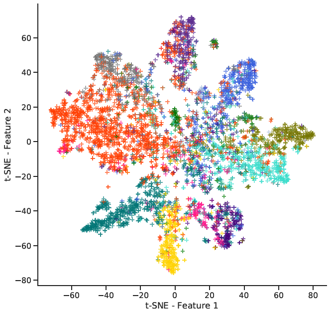
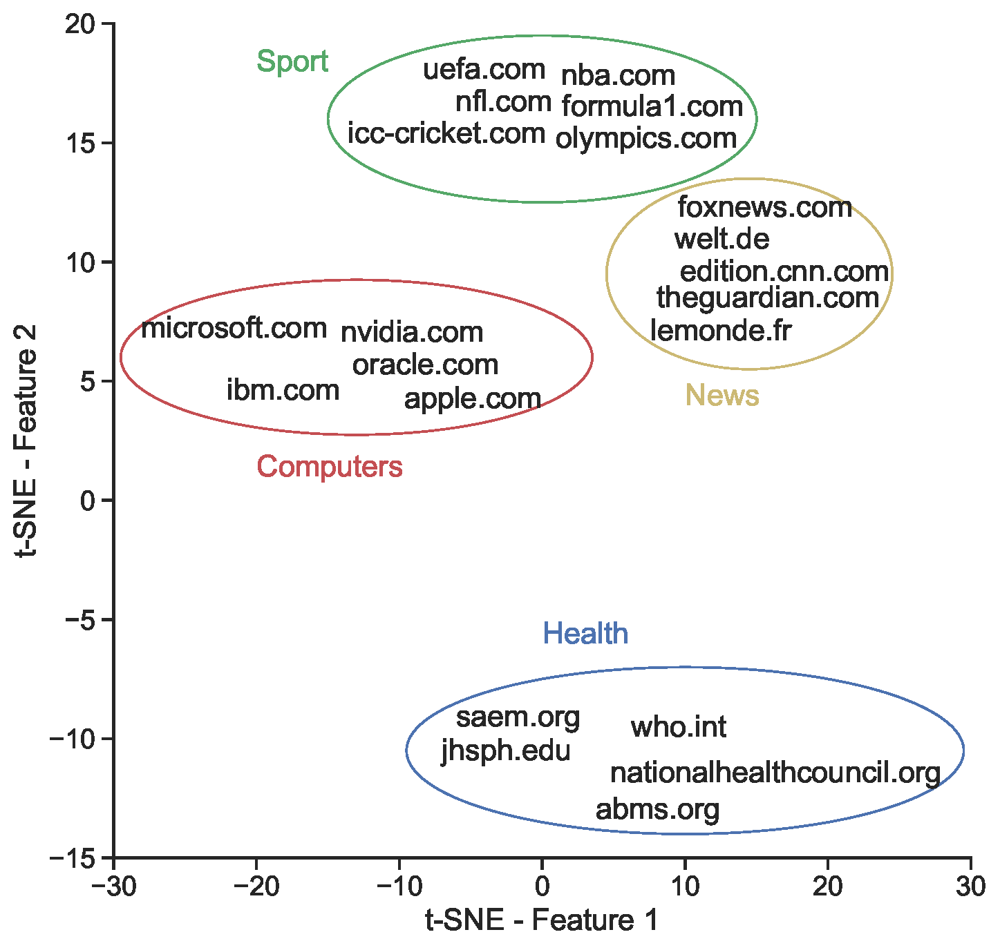

# Homepage2Vec

Homepage2Vec: Language-Agnostic Website Embedding and Classification based on Curlie labels
[https://arxiv.org/pdf/2201.03677.pdf](https://arxiv.org/pdf/2201.03677.pdf)

Published @ International AAAI Conference on Web and Social Media (ICWSM)

---

Homepage2Vec is a pre-trained model that supports the classification and embedding of websites starting from their homepage.

<p float="left">
  
   
</p>

**Left:** _Projection in two dimensions with t-SNE of the embedding of 5K random samples of the testing set. Colors represent the 14 classes._ **Right:** _The projection with t-SNE of some popular websites shows that embedding vectors effectively capture website topics._

## Curated Curlie Dataset

We release the full training dataset obtained from Curlie. The dataset includes the websites (online in April 2021) with the URL recognized as homepage, and it contains the original labels, the labels aligned to English, and the fetched HTML pages.

Get it here: [https://doi.org/10.6084/m9.figshare.19406693](https://doi.org/10.6084/m9.figshare.19406693)


## Getting started with the library


### Installation:

Step 1: install the library with pip.
```
pip install homepage2vec
```

[//]: # ()
[//]: # ([Optional] Step 2: Install the [Selenium Chrome web driver]&#40;https://chromedriver.chromium.org/downloads&#41;, and add the folder to the system $PATH variable.)

[//]: # ()
[//]: # (Please note that you need a local copy of Chrome browser &#40;See [Getting started]&#40;https://chromedriver.chromium.org/getting-started&#41;&#41;.)

### Usage:

```python
import logging
from homepage2vec.model import WebsiteClassifier

logging.getLogger().setLevel(logging.DEBUG)

model = WebsiteClassifier()

website = model.fetch_website('epfl.ch')

scores, embeddings = model.predict(website)

print("Classes probabilities:", scores)
print("Embedding:", embeddings)
```
Result:
```
Classes probabilities: {'Arts': 0.3674524128437042, 'Business': 0.0720655769109726,
 'Computers': 0.03488553315401077, 'Games': 7.529282356699696e-06, 
 'Health': 0.02021787129342556, 'Home': 0.0005890956381335855, 
 'Kids_and_Teens': 0.3113572597503662, 'News': 0.0079914266243577, 
 'Recreation': 0.00835705827921629, 'Reference': 0.931416392326355, 
 'Science': 0.959597110748291, 'Shopping': 0.0010162043618038297, 
 'Society': 0.23374591767787933, 'Sports': 0.00014659571752417833}
 
Embedding: [-4.596550941467285, 1.0690114498138428, 2.1633379459381104,
 0.1665923148393631, -4.605356216430664, -2.894961357116699, 0.5615459084510803, 
 1.6420538425445557, -1.918184757232666, 1.227172613143921, 0.4358430504798889, 
 ...]
```

The library automatically downloads the pre-trained models homepage2vec and XLM-R at the first usage.

### Using visual features

If you wish to use the prediction using the visual features, Homepage2vec needs to take a screenshot of the website. This means you need a working copy of Selenium and the Chrome browser. Please note that as reported in the reference paper, the performance improvement is limited.

Install the [Selenium Chrome web driver](https://chromedriver.chromium.org/downloads), and add the folder to the system $PATH variable. You need a local copy of Chrome browser (See [Getting started](https://chromedriver.chromium.org/getting-started)).


## Getting involved

We invite contributions to Homepage2Vec! Please open a [pull request](https://github.com/epfl-dlab/homepage2vec/pulls) if you have any suggestions.


## Original publication

**Homepage2Vec: Language-Agnostic Website Embedding and Classification**

Sylvain Lugeon, Tiziano Piccardi, Robert West

_Currently, publicly available models for website classification do not offer an embedding method and have limited support for languages beyond English. We release a dataset of more than two million category-labeled websites in 92 languages collected from Curlie, the largest multilingual human-edited Web directory. The dataset contains 14 website categories aligned across languages. Alongside it, we introduce Homepage2Vec, a machine-learned pre-trained model for classifying and embedding websites based on their homepage in a language-agnostic way. Homepage2Vec, thanks to its feature set (textual content, metadata tags, and visual attributes) and recent progress in natural language representation, is language-independent by design and generates embedding-based representations. We show that Homepage2Vec correctly classifies websites with a macro-averaged F1-score of 0.90, with stable performance across low- as well as high-resource languages. Feature analysis shows that a small subset of efficiently computable features suffices to achieve high performance even with limited computational resources. We make publicly available the curated Curlie dataset aligned across languages, the pre-trained Homepage2Vec model, and libraries._

[https://arxiv.org/pdf/2201.03677.pdf](https://arxiv.org/pdf/2201.03677.pdf)


## Citation format

If you found the provided resources useful, please cite the paper:

**BibTex**
```
@inproceedings{lugeon2022language,
  title={Homepage2Vec: Language-Agnostic Website Embedding and Classification},
  author={Lugeon, Sylvain and Piccardi, Tiziano and West, Robert},
  booktitle={Proceedings of the International AAAI Conference on Web and Social Media},
  year={2022}
}
```

**Chicago**
```
Lugeon, Sylvain, Tiziano Piccardi, and Robert West. "Homepage2Vec: Language-Agnostic Website Embedding and Classification." In Proceedings of the International AAAI Conference on Web and Social Media, 2022
```

## Dataset License

Creative Commons Attribution 3.0 Unported License - [Curlie](https://curlie.org/docs/en/license.html)

Learn more how to contribute: https://curlie.org/docs/en/about.html

